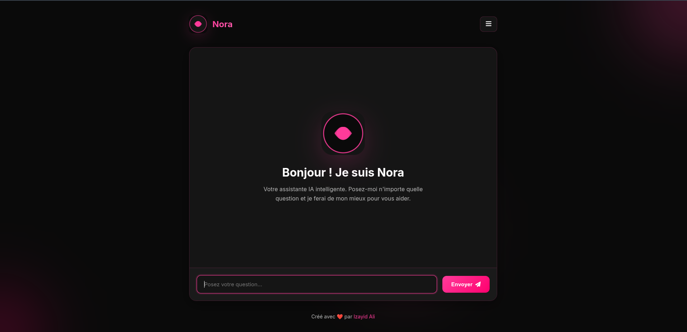
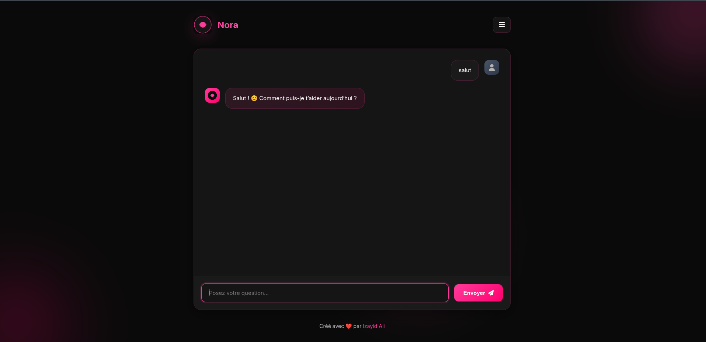

# Nora 🧠 — Assistante IA conversationnelle

**Nora** est une assistante IA conversationnelle avec une interface de chat moderne, sombre et animée. Le projet est né d'un exposé étudiant sur les algorithmes et modèles de deep learning, avec l'ambition de transformer la théorie du cours en démo concrète et utilisable.

<!--
  📸 Capture d'écran — à ajouter ici une fois disponible.
  Suggestion : une capture de l'écran d'accueil avec le message de
  bienvenue, et une d'une conversation en cours avec Nora.

  
  
-->

## Pourquoi ce projet ?

Nora est né d'un exposé sur les algorithmes et modèles de deep learning donné dans le cadre d'un cours d'intelligence artificielle. Plutôt que d'en rester à la théorie, l'idée était de construire une petite IA conversationnelle de bout en bout — du prompt système jusqu'à l'interface de chat — pour comprendre concrètement comment un LLM s'intègre dans une vraie application web.

## Fonctionnalités

- 💬 **Chat en temps réel** avec Nora, propulsée par l'API Mistral
- 🎨 **Interface soignée** — thème sombre, fond animé (orbes en dégradé), sidebar "À propos" avec liens sociaux
- 🧠 **Personnalité définie** via un prompt système dédié
- 📱 Interface responsive, pensée mobile-first

## Stack technique

**Backend**
- [Flask](https://flask.palletsprojects.com/) (architecture en blueprint) — serveur web Python
- [Mistral AI API](https://mistral.ai/) — moteur conversationnel
- [python-dotenv](https://pypi.org/project/python-dotenv/) — gestion des clés API et variables d'environnement
- [Gunicorn](https://gunicorn.org/) — serveur WSGI de production

**Frontend**
- HTML / CSS / JavaScript vanilla
- [Font Awesome](https://fontawesome.com/) — icônes

**Architecture**

```
nora/
├── __init__.py         # Factory create_app()
├── routes.py            # Routes Flask (blueprint "main")
├── core/
│   └── config.py         # Configuration (clés API, secrets)
└── services/
    └── miltrat_api.py     # Appel à l'API Mistral
templates/
└── index.html            # Interface de chat
static/
├── css/style.css
└── js/script.js
wsgi.py                   # Point d'entrée pour Gunicorn
app.py                     # Point d'entrée pour le développement local
```

## Lancer le projet en local

### Prérequis
- Python 3.10+
- Une clé API [Mistral AI](https://console.mistral.ai/)

### Installation

```bash
# 1. Cloner le dépôt
git clone https://github.com/izayid-04/noraIA.git
cd noraIA

# 2. Créer un environnement virtuel
python -m venv venv
source venv/bin/activate  # sous Windows : venv\Scripts\activate

# 3. Installer les dépendances
pip install -r requirements.txt
```

### Configuration

Crée un fichier `.env` à la racine du projet :

```
SECRET_KEY=change_moi
MILTRAT_API_KEY=ta_clé_api_mistral
MILTRAT_API_URL=https://api.mistral.ai/v1/chat/completions
FLASK_DEBUG=True

# Optionnel — liens affichés dans la sidebar
PORTFOLIO_URL=
GITHUB_URL=
LINKEDIN_URL=
TWITTER_URL=
```

### Démarrage

```bash
python app.py
```

L'application est accessible sur [http://localhost:5000](http://localhost:5000).

En production, l'app est servie via Gunicorn à partir du point d'entrée `wsgi.py` :

```bash
gunicorn wsgi:app
```

## Créateur

Projet conçu et développé par **Izayid Ali**, étudiant en Génie Logiciel, passionné par l'IA et le deep learning.

## Licence

Projet académique — tous droits réservés © 2025.
